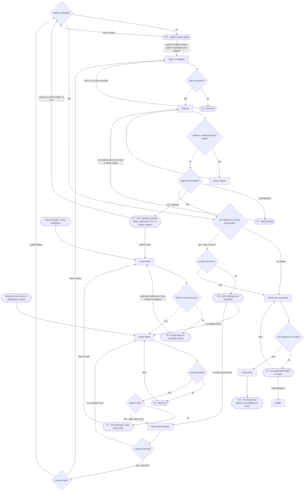
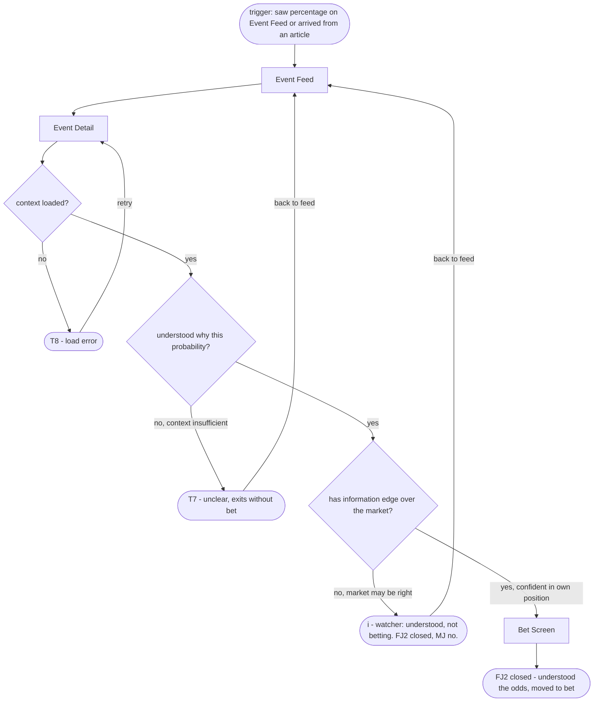
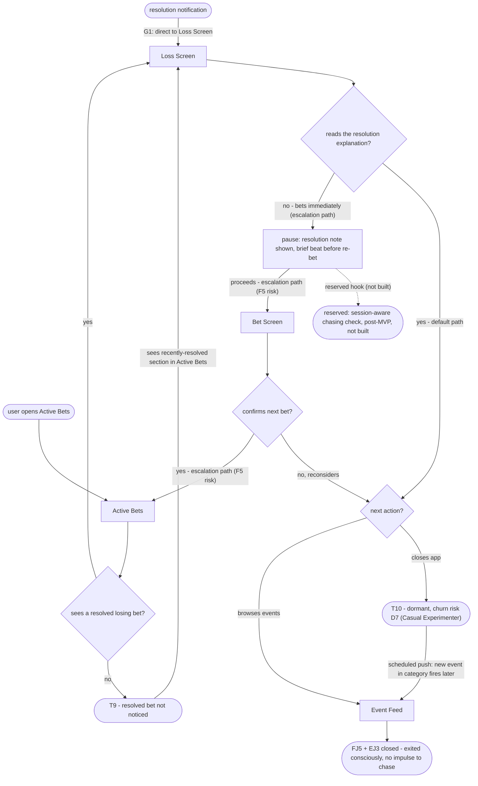
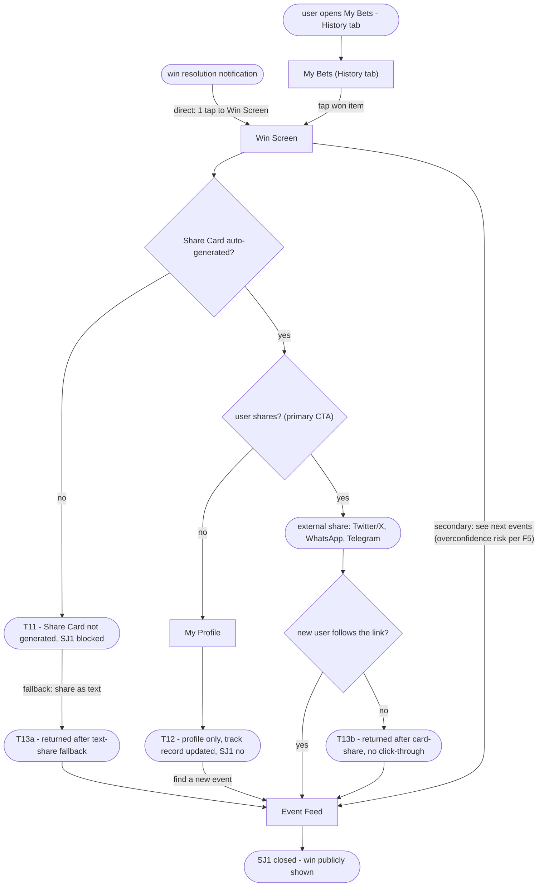

# User Flows - Prediction Market Platform

> Built from: IA/sitemap.md - jtbd.md
> `[Square brackets]` = screens from IA/sitemap.md. `{Diamonds}` = decisions. `([Stadiums])` = terminal states.
> Success terminals: T14/mjDone, fj2Done, fj5Done, sj1Done. Error/churn terminals T1-T3, T5-T12, T13a, T13b, T15-T16 each have at least one recovery edge. T4 retired as terminal (replaced by escalation-path edge in FJ5).

---

## Terminal map

| T# | Meaning | Flow | Type |
|---|---|---|---|
| T1 | KYC rejected | MJ - Deposit branch | error |
| T2 | Card declined | MJ - Deposit branch | error |
| T3 | Bet registration failed on-chain | MJ - after execute | error |
| T4 | RETIRED - was chasing risk sink | FJ5 | retired |
| T5 | Auth error | MJ - Sign In branch | error |
| T6 | Empty feed (first visit, no events) | MJ - after Event Feed | churn |
| T7 | Not convinced / context insufficient | MJ + FJ2 - after Event Detail | churn |
| T8 | Event Detail load error | MJ + FJ2 | error |
| T9 | Resolved bet not noticed | FJ5 - Active Bets | churn |
| T10 | Dormant (closed app) | FJ5 - conscious-exit path | churn |
| T11 | Share Card not generated | SJ1 - after Win Screen | error |
| T12 | Profile only (shared nothing) | SJ1 - shares no | churn |
| T13a | Returned after text-share fallback (Share Card not generated) | SJ1 - T11 path | recovery |
| T13b | Returned after card-share, no click-through | SJ1 - no new user followed link | recovery |
| T14 | MJ closed - bet placed | MJ - success | success |
| T15 | Wallet connect failed | MJ - Crypto Native branch | error |
| T16 | Price rejected at S5 reconcile | MJ - priceConfirm no | churn |

> Coverage note: Flows are drawn for the main job and key related jobs only. Jobs and screens without a dedicated flow (SJ2, Notifications list, Bet History tab) are covered passively or inside existing screens - this is by design, not a gap.

> Deferred polish (P3 - later pass): P3-3 (HIW static vs fetch clarification), P3-4 (first-visit vs return-visit layout naming on Event Feed), P3-6 (minimal Wallet withdrawal flow), P3-7 (HIW as optional step in FJ2).

---

## MJ - When an event I follow is approaching resolution, I want a real stake on the outcome

---

## FJ2 - When I see an event and its probability, I want to understand why the market prices it that way

---

## FJ5 + EJ3 - When an event I bet on resolves with a loss, I want to exit consciously without the impulse to chase

---

## SJ1 - When I win a bet on an event everyone talked about, I want to easily show that to my circle

