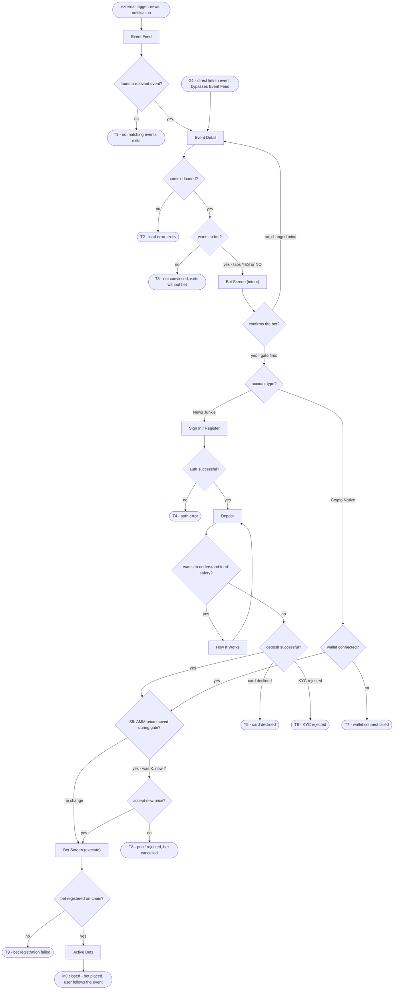
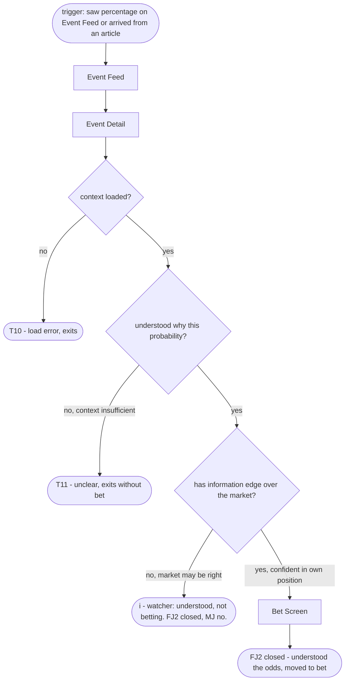
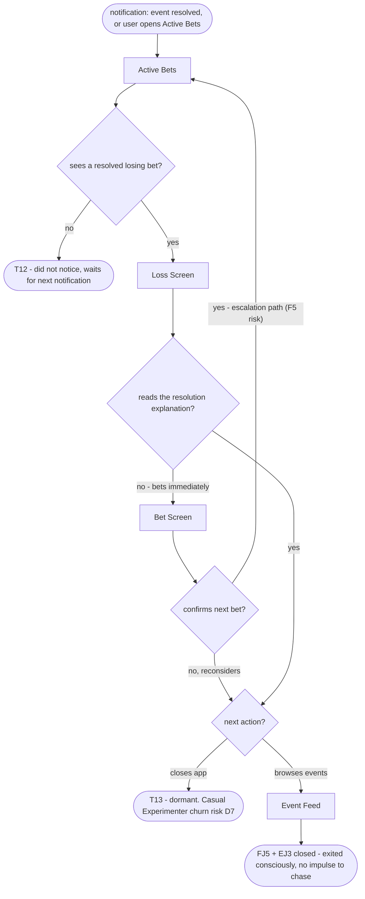
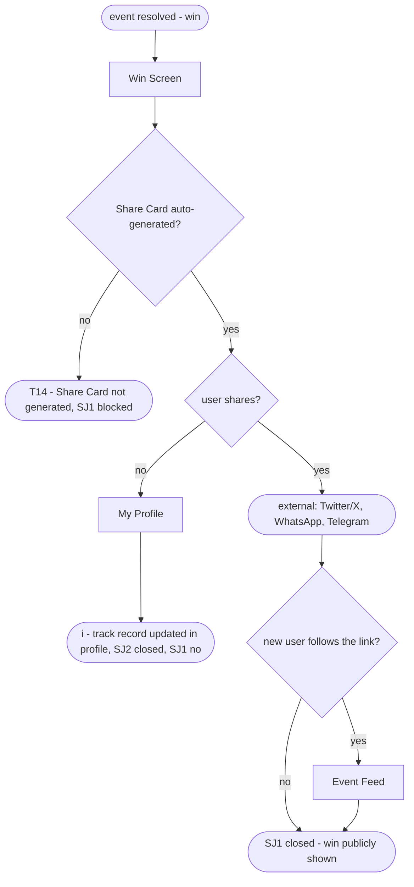

# User Flows - Prediction Market Platform

> Built from: sitemap.md - jtbd.md
> `[Square brackets]` = screens from sitemap.md. `{Diamonds}` = decisions. `([Stadiums])` = terminal states.
> Dead-end and error terminals: T1-T14. Info states labeled with i.

---

## MJ - When an event I follow is approaching resolution, I want a real stake on the outcome

---

## FJ2 - When I see an event and its probability, I want to understand why the market prices it that way

---

## FJ5 + EJ3 - When an event I bet on resolves with a loss, I want to exit consciously without the impulse to chase

---

## SJ1 - When I win a bet on an event everyone talked about, I want to easily show that to my circle

