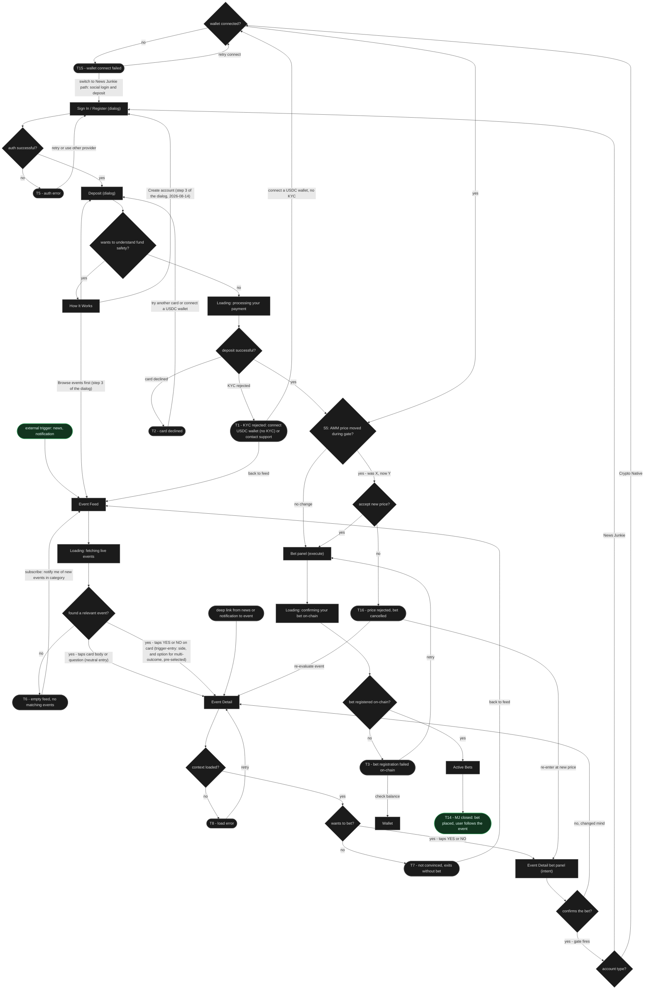
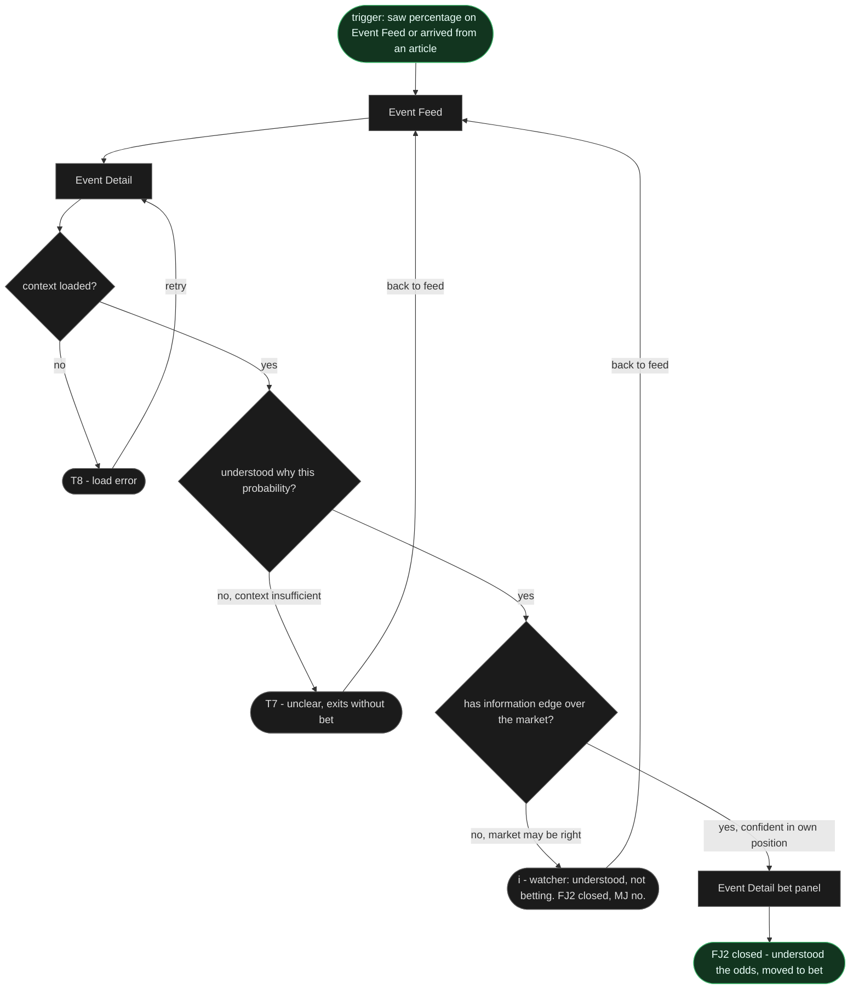
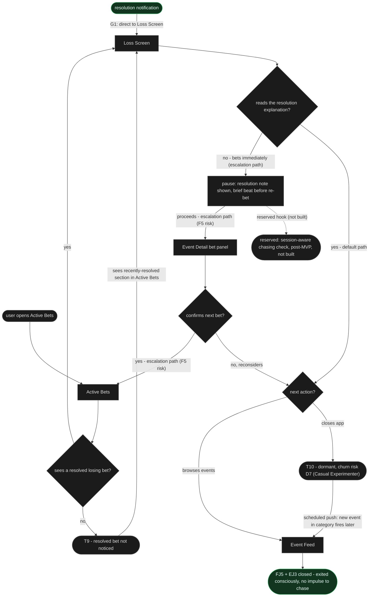
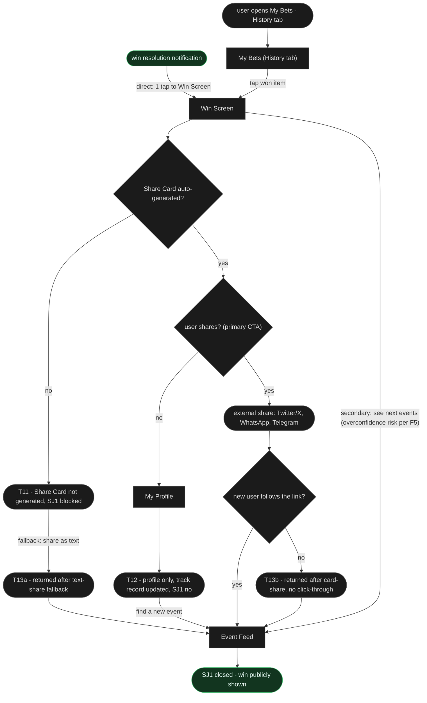

# User Flows - Prediction Market Platform

> Built from: ia/docs/sitemap.md - jtbd.md
> `[Square brackets]` = screens from ia/docs/sitemap.md. `{Diamonds}` = decisions. `([Stadiums])` = terminal states.
> Success terminals: T14/mjDone, fj2Done, fj5Done, sj1Done. Error/churn terminals T1-T3, T5-T12, T13a, T13b, T15-T16 each have at least one recovery edge. T4 retired as terminal (replaced by escalation-path edge in FJ5).
>
> Wireframe build pass (re-sync with ia/docs/sitemap.md "Wireframe build pass"): the flow logic is unchanged, only the surfaces are renamed. **BS1 / BS2 are the Event Detail bet panel** (build the bet inline, then execute), not a standalone Bet Screen. **SI (Sign In) and DEP (Deposit) are in-page dialogs** opened over the current page (close stays on the page; Sign In chains to Deposit). The sequence build -> confirm -> gate -> S5 reconcile -> execute -> Active Bets is the same. A category page (Politics/Crypto/Culture/General) is an optional browse node between Event Feed and Event Detail; it is omitted from the charts to keep them stable (it inherits the Event Feed -> Event Detail edge).
>
> **Outcome coloring (added this pass):** every Mermaid flow is colored by outcome - green = the happy-path start node + the job-closed success terminal; red = a true dead-end (a terminal with no path back to the goal); grey/neutral = every intermediate screen, decision, and loading/empty/error node that recovers. Verified: all error and churn terminals here (T6, T7, T9, T10, T12, T16 and the rest) carry a recovery edge back into the flow, so none are true dead-ends - the red `dead` class stays defined but unused.
>
> **Traces to the CJM To-Be** (`user-research/docs/cjm-to-be.md`, Alex x MJ). The 7 To-Be steps: 1. arrive on a live event, not a signup; 2. understand the market before any account; 3. tap YES/NO and see the bet intent before signing in; 4. sign in and fund with one funds-safety line; 5. confirm with the price reconciled; 6. follow your bet with live context; 7. resolution designed both ways. Per-flow mapping is under each diagram.

---

## Terminal map

| T# | Meaning | Flow | Type |
|---|---|---|---|
| T1 | KYC rejected | MJ - Deposit branch | error |
| T2 | Card declined | MJ - Deposit branch | error |
| T3 | Bet registration failed on-chain | MJ - after execute | error |
| T4 | RETIRED - was chasing risk sink | FJ5 | retired |
| T5 | Auth error | MJ - Sign In branch | error |
| T6 | Empty feed (first visit, no events) | MJ - after Event Feed | churn |
| T7 | Not convinced / context insufficient | MJ + FJ2 - after Event Detail | churn |
| T8 | Event Detail load error | MJ + FJ2 | error |
| T9 | Resolved bet not noticed | FJ5 - Active Bets | churn |
| T10 | Dormant (closed app) | FJ5 - conscious-exit path | churn |
| T11 | Share Card not generated | SJ1 - after Win Screen | error |
| T12 | Profile only (shared nothing) | SJ1 - shares no | churn |
| T13a | Returned after text-share fallback (Share Card not generated) | SJ1 - T11 path | recovery |
| T13b | Returned after card-share, no click-through | SJ1 - no new user followed link | recovery |
| T14 | MJ closed - bet placed | MJ - success | success |
| T15 | Wallet connect failed | MJ - Crypto Native branch | error |
| T16 | Price rejected at S5 reconcile | MJ - priceConfirm no | churn |

> Coverage note: Flows are drawn for the main job and key related jobs only. Jobs and screens without a dedicated flow (SJ2, Notifications list, Bet History tab) are covered passively or inside existing screens - this is by design, not a gap.

> Deferred polish (P3 - later pass): P3-3 (HIW static vs fetch clarification), P3-4 (first-visit vs return-visit layout naming on Event Feed), P3-6 (minimal Wallet withdrawal flow), P3-7 (HIW as optional step in FJ2).

---

## MJ - When an event I follow is approaching resolution, I want a real stake on the outcome

**The How It Works DIALOG became a way IN on 2026-08-14, and that is a change to this map rather than
to a stylesheet.** It used to be a leaf: two explainer sections, a FAQ and a button back to its own
page, so every path that reached it had to turn around. It is three steps now and the third carries
`Create account`, to `sign-in.html`, with `Browse events first` under it, to the feed. **Both edges
are drawn above** because a dialog that can start a signup is a node with outgoing edges, and a map
that shows it as a leaf would be describing the version before. The quiet second edge is not
politeness: this product lets a person build a bet before connecting a wallet, and a single
funnel-shaped exit would contradict a sentence the same dialog has just made. `docs/decisions.md`,
2026-08-14.

**Loading states (async waits, neutral):** three inline loading nodes mark the real
waits - `feedLoad` (fetching the live feed) before the feed decision, `depProcessing`
(processing the card payment) before the deposit result, and `betProcessing` (confirming
the bet on-chain) before the on-chain result.

**Traces to CJM To-Be (Alex x MJ, steps 1-7):** story-led feed (1) -> explain the number
on Event Detail (2) -> tap YES/NO, bet intent before the wallet, gate at Confirm (3) ->
Sign In + fund with the funds-safety line (4) -> Confirm with the S5 price reconcile (5) ->
follow the bet in Active Bets (6) -> resolution both ways (7). Source:
`user-research/docs/cjm-to-be.md`.

**Card trigger-entry (Event Feed -> Event Detail, two variants of the same edge):**
Tapping a card never places a bet and never bypasses Event Detail. Two ways into
Event Detail from a card:
- Tap the card body or question: opens Event Detail neutrally (the beginner who
  wants to understand first).
- Tap YES or NO on the card: opens Event Detail with the side pre-selected and,
  for multi-outcome, the option pre-selected (the informed user who wants to move
  faster).
  **THE SIDE IS IN THE URL, decided 2026-08-13, `docs/backlog.md` 143.** Both halves of every
  YES / NO pair sent the reader to the same address until then, 126 pairs of 126, so the card
  offered three tab stops to one destination and, once backlog 103 had made each control say
  which side it takes, **the accessible name promised a distinction the link did not make**. It is
  `?side=yes` and `?side=no` now, 212 anchors in the paint, 212 in the grey and 72 on the stand.
  The consequence is the reason it is an IA line and not a markup one: **a pre-selection that lives
  in the URL survives a share, a bookmark and a back button**, and one that lives in a click does
  not. It also gives the multi-outcome row somewhere to put the option the sentence above already
  promises.
Both land on Event Detail, so FJ2 (context before the bet) is preserved for
everyone. The bet is still placed on Event Detail (in its inline bet panel). There
is no Feed -> bet edge: nothing bypasses the context screen. Event Detail must
accept a pre-selected option and side on entry (pre-selected entry variant, see
ia/docs/sitemap.md Event Detail states).

---

## FJ2 - When I see an event and its probability, I want to understand why the market prices it that way

**Traces to CJM To-Be step 2** (understand the market before any account: explain the
number, inline probability + one-line why + the story, spectator language), feeding step 3
(bet intent) for the user who finds an edge. Source: `user-research/docs/cjm-to-be.md`.

---

## FJ5 + EJ3 - When an event I bet on resolves with a loss, I want to exit consciously without the impulse to chase

**Traces to CJM To-Be step 7, loss half** (resolution designed both ways: "Here's what
happened" + context + a next step that is NOT "bet again"; the pause / escalation node
embodies the F5 loss-chasing guardrail). Source: `user-research/docs/cjm-to-be.md`.

---

## SJ1 - When I win a bet on an event everyone talked about, I want to easily show that to my circle

**Traces to CJM To-Be step 7, win half** ("You were right" + share, with the F5
overconfidence friction; "see next events" is the deliberate secondary CTA, not the
primary). Source: `user-research/docs/cjm-to-be.md`.
